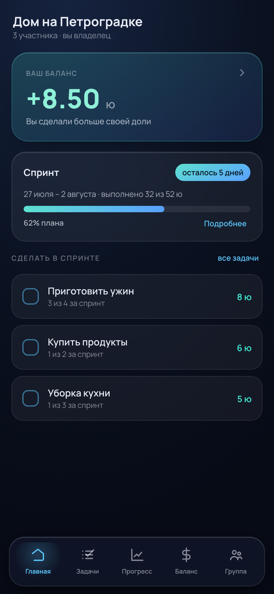
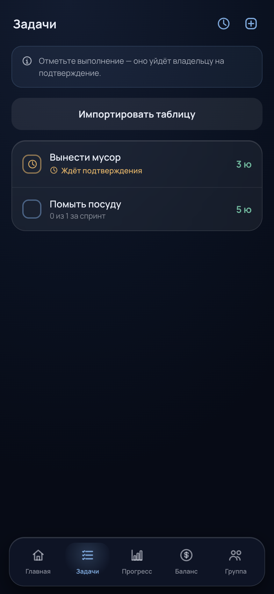
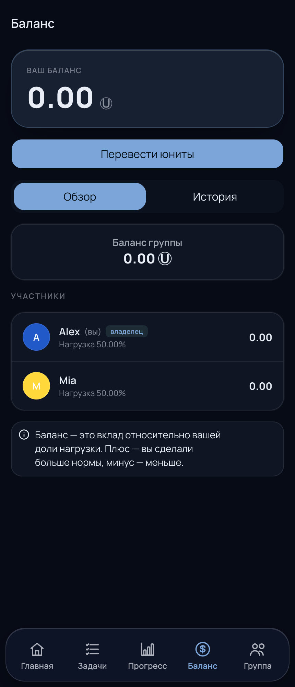
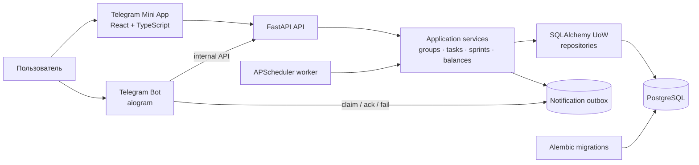

# UnitKeeper

[](https://github.com/ilyascw/UnitKeeperBot/actions/workflows/ci.yml)


Telegram Mini App для управления повторяющимися задачами, распределения командной
нагрузки и взаиморасчётов в условных единицах.

UnitKeeper превращает бытовые или командные договорённости в измеримый процесс:
участники видят план спринта, отмечают выполненные задачи, подтверждают результат
друг друга и получают прозрачный баланс относительно своей доли нагрузки.

Продукт проверен в трёх реальных группах. Самая долго жившая группа использовала
его в каждом спринте на протяжении 11 месяцев; ещё две — в течение трёх и двух
месяцев.

## Интерфейс

| Главная: состояние спринта | Задачи и подтверждения | Баланс участников |
| --- | --- | --- |
|  |  |  |

Скриншоты сняты на нейтральном демонстрационном наборе данных; пользовательские
данные и Telegram-токены в репозиторий не включены.

## Почему я сделал этот проект

UnitKeeper вырос из моей личной бытовой проблемы. В совместном хозяйстве
повторяющиеся дела обычно распределяются устно: со временем становится трудно
помнить, кто и сколько сделал, одинаково ли участники понимают свою долю нагрузки
и действительно ли задача завершена. Сам учёт тоже превращается в дополнительную
работу и может становиться источником напряжения.

Я перевёл эти договорённости в короткие спринты с устойчивым набором домашних
задач. После нескольких циклов группе уже не нужно заново обсуждать базовый план:
участник открывает приложение, выбирает доступную задачу и получает понятный
результат в общих единицах. Геймификация особенно полезна для небольших
рутинных дел — задач для «внутренней обезьянки» в терминологии Максима Дорофеева.
Задачу можно быстро выбрать из списка, закрыть и получить видимый результат в
балансе спринта.

Peer-approval фиксирует общий критерий завершения задачи. Другой участник
подтверждает результат или возвращает задачу с причиной. История действий,
заранее согласованные веса и баланс дают всем участникам одну картину
происходящего.

## Проверка гипотезы и итерации

Продукт использовали три реальные группы:

| Группа | Период активного использования | Наблюдение |
| --- | ---: | --- |
| Группа с моим участием | 11 месяцев | Стабилизировался повторяющийся набор задач; приложение использовали в каждом спринте |
| Вторая группа | 3 месяца | Подтвердилась применимость механики за пределами моей бытовой группы |
| Третья группа | 2 месяца | Базового сценария хватило для регулярного совместного использования |

Пользователям мешал UX старого Telegram-бота: по мере роста сценариев навигация
через команды и сообщения занимала всё больше действий. Я пересобрал прототипы
экранов с помощью Claude, перенёс основной сценарий в Telegram Mini App и
переработал backend. Бизнес-правила, persistence и transport получили отдельные
границы; появились миграции, идемпотентность и надёжная доставка уведомлений.

После 11 месяцев потребность самой долго жившей группы сохранилась, а регулярное
использование остановилось во время миграции со старой версии. Следующая
проверка продукта — повторный запуск и usability-тесты с новыми семейными
группами.

### Мой вклад

- сформулировал механику спринтов, весов нагрузки, подтверждений и взаиморасчётов
  из наблюдений за реальным бытовым процессом;
- проверил продуктовую гипотезу на трёх группах и определил навигацию старого
  бота главным ограничением версии;
- переработал пользовательский сценарий из Telegram-бота в Mini App;
- спроектировал разделение frontend, bot, backend и persistence-контуров;
- реализовал доменные инварианты, ledger, outbox, идемпотентные фоновые операции,
  миграции и автоматические проверки.

## Бизнес-ценность

| Проблема | Решение в UnitKeeper |
| --- | --- |
| Повторяющиеся задачи распределяются устно и быстро забываются | Каталог задач с частотой, стоимостью и остатком выполнений в спринте |
| Вклад участников оценивается субъективно | План/факт в юнитах и персональные веса нагрузки |
| Выполнение нельзя проверить | Peer-approval: подтверждение или отклонение с причиной |
| Взаимные долги непрозрачны | Персональные балансы и append-only double-entry ledger |
| Напоминания и отчёты требуют ручной работы | Планировщик закрытия спринтов и transactional outbox для Telegram-уведомлений |

Продукт подходит для небольших команд, совместных хозяйств и любых групп, где
регулярную работу нужно распределять прозрачно, но полноценная project-management
система была бы избыточна.

## Возможности

- создание группы и вступление по коду;
- настройка длительности спринта и весов участников;
- CRUD и табличный импорт повторяющихся задач;
- отметка выполнения и peer-approval;
- прогресс спринта: план, факт и разбивка по задачам;
- переводы юнитов и история операций;
- автоматическое закрытие спринта с защитой от повторной обработки;
- Telegram-уведомления, deep links и повторная доставка через outbox.

## Архитектура



Ключевое архитектурное решение — бизнес-правила принадлежат backend. Mini App и
бот работают через отдельные HTTP-контракты и не обращаются к базе напрямую.
Подробнее: [architecture.md](architecture.md).

### Инженерные решения

- **Telegram auth:** backend проверяет подпись `initData`; клиент не передаёт
  доверенный `user_id`.
- **Clean boundaries:** FastAPI routers → application services → Unit of Work →
  repositories.
- **Финансовая целостность:** переводы и расчёты спринта записываются группами
  проводок, сумма которых равна нулю.
- **Надёжная доставка:** уведомления сохраняются в transactional outbox с
  deduplication key, correlation ID, retry-состоянием и dead-letter статусом.
- **Идемпотентность:** закрытие одного и того же спринта защищено от повторного
  применения.
- **Эволюция схемы:** PostgreSQL-схема версионируется Alembic; отдельный smoke test
  накатывает все миграции на чистую БД.

## Стек

| Слой | Технологии |
| --- | --- |
| Mini App | React 18, TypeScript, Vite, Telegram UI Kit, `@tma.js/sdk-react`, TanStack Query |
| Backend | Python 3.11, FastAPI, Pydantic, Dishka, APScheduler |
| Bot | aiogram 3, httpx |
| Data | PostgreSQL 16, SQLAlchemy 2, Alembic, asyncpg |
| Quality | pytest, mypy strict, Ruff, ESLint, TypeScript strict, GitHub Actions |
| Delivery | Docker, Docker Compose, nginx |

## Структура

```text
.
├── miniapp/   # основной пользовательский интерфейс
├── backend/   # API, use cases, auth, jobs и интеграции
├── bot/       # тонкий Telegram transport
├── common/    # модели SQLAlchemy, Alembic и DB-конфигурация
├── docs/      # продуктовые и эксплуатационные заметки
└── docker-compose.yml
```

## Запуск

Требуются Docker и Docker Compose.

```bash
cp .env.example .env
# Заполнить TELEGRAM_BOT_TOKEN, SESSION_SECRET и INTERNAL_BOT_SECRET

docker compose up --build
```

После запуска:

- Mini App: `http://localhost:8080`;
- OpenAPI: `http://localhost:8000/docs`;
- health check: `http://localhost:8000/api/v1/health`.

По умолчанию стартуют PostgreSQL, миграции, backend, scheduler и web-контейнер.
Telegram-бот включается отдельным профилем:

```bash
docker compose --profile telegram up --build
```

Для реального Mini App публичный URL должен использовать HTTPS и быть указан в
BotFather и в `UNITKEEPER_MINIAPP_URL`.

### Конфигурация

| Переменная | Назначение |
| --- | --- |
| `DATABASE_URL` | async PostgreSQL DSN для backend и миграций |
| `TELEGRAM_BOT_TOKEN` | проверка Telegram `initData` на backend |
| `SESSION_SECRET` | подпись серверных сессий |
| `INTERNAL_BOT_SECRET` | авторизация bot → backend |
| `UNITKEEPER_BOT_TOKEN` | токен polling-процесса aiogram |
| `UNITKEEPER_MINIAPP_URL` | публичный HTTPS URL приложения |

Полный безопасный шаблон находится в [.env.example](.env.example).

## Разработка и контроль качества

Каждый Python-компонент имеет собственный `pyproject.toml`, lock-файл и
изолированную `.venv`.

```bash
# Python-сервисы
cd backend && uv sync --frozen --extra dev --group dev
uv run ruff check .
uv run ruff format --check .
uv run mypy
uv run pytest

# Аналогично для bot и common; у common dev-зависимости подключаются через:
cd ../common && uv sync --frozen --group dev

# Frontend
cd ../miniapp
npm ci
npm run lint
npm run typecheck
npm run build
```

CI выполняет эти проверки для каждого слоя и дополнительно проверяет миграции на
чистом PostgreSQL. В репозитории более 80 unit, contract и integration tests.

### Метрики качества

Качество продукта проверяется через доменные инварианты:

| Сигнал | Как проверяется |
| --- | --- |
| Корректность sprint math | unit-тесты границ периода, план/факт и bonus logic |
| Целостность баланса | тесты переводов и zero-sum групп проводок |
| Идемпотентность | повторное закрытие спринта и dedupe уведомлений |
| Совместимость API | contract tests FastAPI-схем и internal bot transport |
| Схема данных | Alembic upgrade до `head` на пустой PostgreSQL |
| Статическая корректность | `mypy --strict`, TypeScript strict, Ruff, ESLint |

Для runtime-диагностики предусмотрены health endpoint, correlation ID фоновых
задач и сохраняемый lifecycle outbox-событий.

## Ограничения

- расписание закрытия спринтов сейчас вычисляется в UTC;
- Mini App требует Telegram `initData`, обычный браузер подходит только для
  разработки с валидным dev init data;
- HTTPS/TLS и внешний reverse proxy остаются ответственностью окружения;
- автоматический Prometheus exporter пока не реализован.
