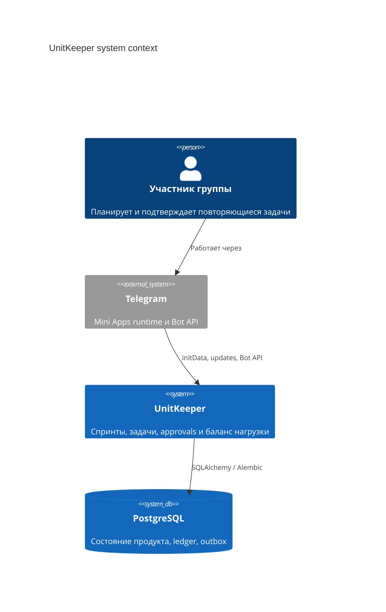
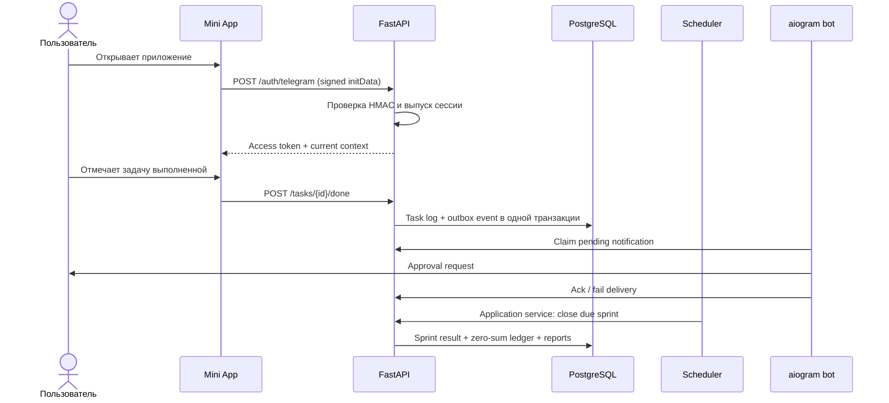

# UnitKeeper Architecture

## Контекст системы

UnitKeeper состоит из четырёх независимо запускаемых компонентов:

1. `miniapp` — ежедневный интерфейс внутри Telegram WebView;
2. `backend` — единственный владелец бизнес-правил и HTTP-контрактов;
3. `bot` — transport для команд, уведомлений и deep links;
4. `common` — схема данных, миграции и общая persistence-модель.



## Контейнеры и потоки данных



## Backend

Backend разделён по направлению зависимостей:

```text
api/                 FastAPI routers, auth dependencies, Pydantic schemas
application/         use cases, ports, orchestration и jobs
domain/              ошибки и чистая sprint math
infrastructure/      SQLAlchemy repositories, UoW, auth, clock
entrypoints/         API и отдельный scheduler process
```

FastAPI router не содержит SQL и расчётов. Application service работает с
портами и Unit of Work; конкретные SQLAlchemy-репозитории подключаются через
Dishka.

## Data model

Основные агрегаты:

- `groups`, `group_memberships`, `group_member_weights`;
- `tasks`, `task_logs`;
- `sprint_runs`, `sprint_member_results`;
- `balances`, `balance_transactions`;
- `notification_outbox_events`, `notification_delivery_attempts`;
- `idempotency_keys`.

`balances.current_balance` — быстрый read model. Аудируемым источником изменений
служит append-only `balance_transactions`. Логическая операция объединяет
проводки через `transaction_group_id`; сумма `amount_delta` в группе должна
равняться нулю.

## Надёжность и безопасность

- Telegram `initData` проверяется на backend по токену бота и TTL.
- Bot использует отдельный internal transport с shared secret.
- Scheduler запускается отдельным процессом; duplicate protection хранится в БД.
- Outbox отделяет фиксацию бизнес-события от нестабильного Telegram API.
- Ошибки доставки подтверждаются через `ack`/`fail`, retries не теряют исходное
  событие и correlation ID.
- Alembic smoke test проверяет полное развёртывание схемы с нуля.

## Известные компромиссы

- Групповой join code пока хранится как прикладной secret, а не как отдельная
  invitation entity.
- Планировщик использует UTC, timezone группы ещё не влияет на cron.
- Ledger имеет структурные ограничения на отдельные проводки; периодическая
  reconciliation-проверка read model пока не реализована.
