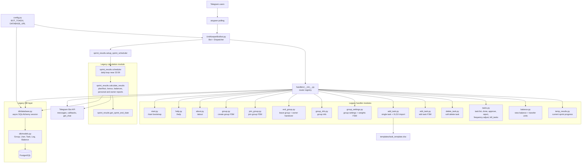
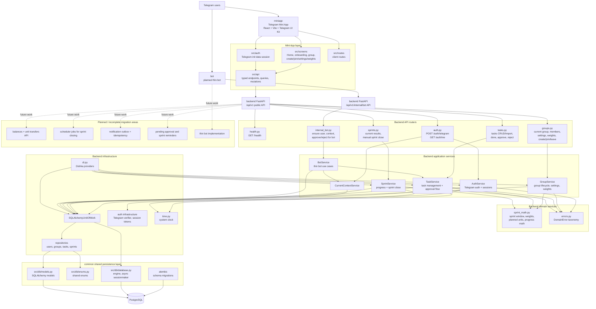

# UnitKeeper Architecture

This document captures two states of the project:

- legacy architecture from `UnitKeeperBot`;
- current migrated architecture in this repository.

## Legacy Bot Architecture

## Current Migrated Architecture

