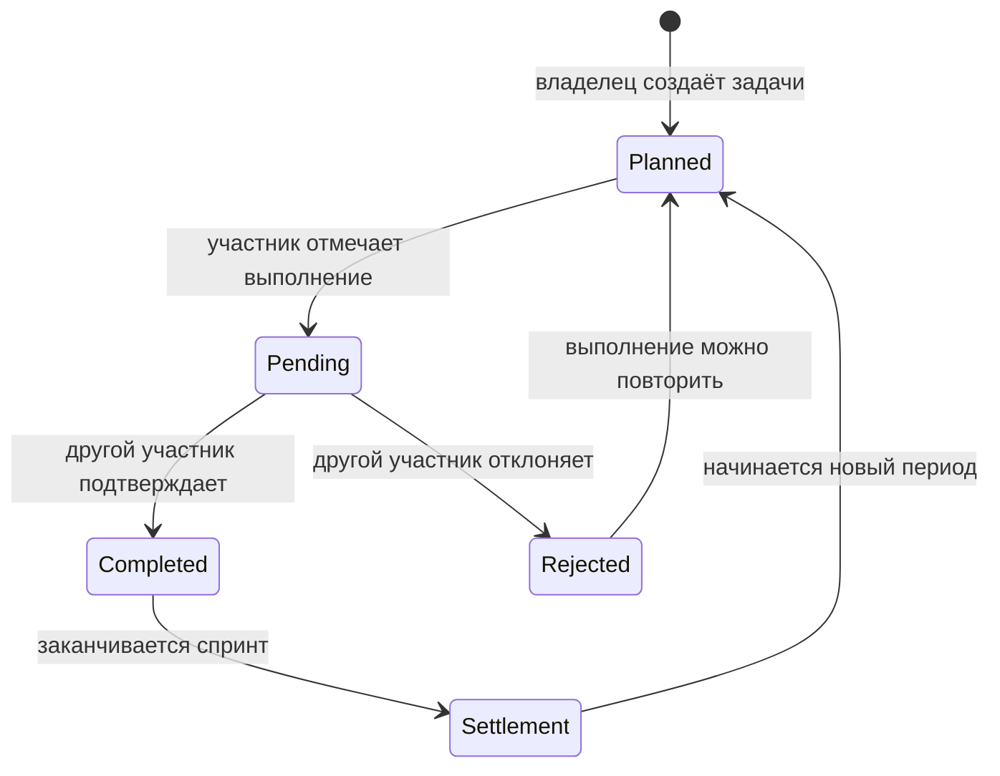

# Product Model

## Зачем нужны юниты

Обычный checklist отвечает только на вопрос «сделано или нет». UnitKeeper
добавляет стоимость работы и долю нагрузки участника, поэтому группа видит не
количество галочек, а вклад относительно согласованного плана.

Пример:

- на спринт назначено задач на 100 юнитов;
- вес участника — 40%;
- его план — 40 юнитов;
- выполнено и подтверждено 46 юнитов;
- отклонение `+6` попадает в расчёт персонального баланса.

Юниты не являются деньгами. Это внутренняя мера вклада, которую группа сама
привязывает к сложности и полезности задач.

## Основной цикл

## Роли

**Участник** видит задачи, отмечает выполнение, подтверждает работу других,
следит за прогрессом и переводит юниты.

**Владелец группы** дополнительно управляет настройками спринта, весами и
каталогом задач. Backend проверяет полномочия независимо от состояния UI.

## Доменные инварианты

- сумма весов активных участников равна 100%;
- задача не может быть подтверждена сверх частоты текущего спринта;
- участник не подтверждает собственную pending-запись в многопользовательской
  группе;
- перевод не создаёт и не уничтожает юниты: debit + credit = 0;
- один период группы закрывается не более одного раза;
- одно логическое уведомление создаётся не более одного раза по `dedupe_key`.
